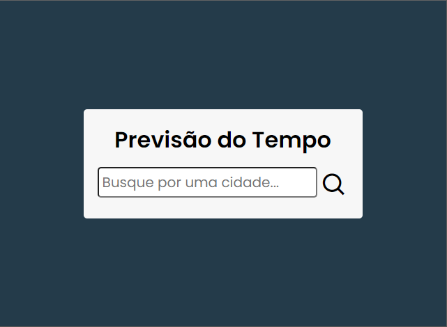
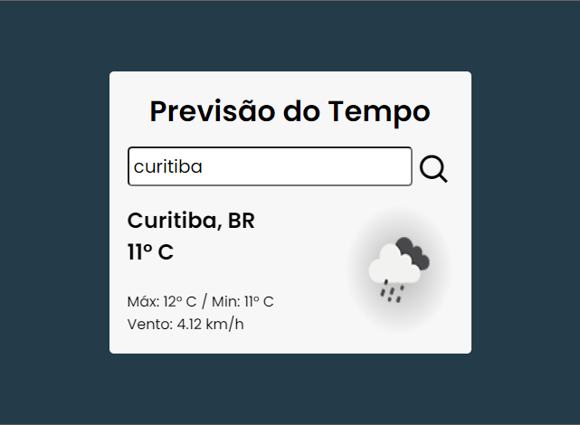

<h1 align="center"> Previsão do Tempo </h1>

## 💻 Sobre o projeto
Projeto de ferramenta para previsão do tempo feito em HTML, CSS e Javascript, utilizando a API do OpenWeather.

## Autor

Feito por ***Rafael Morais***
 
👋🏽 Entre em contato!

